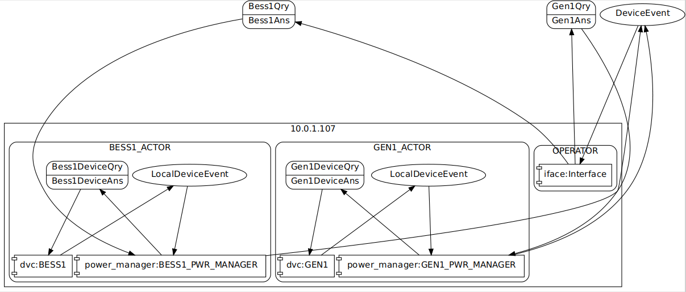

# RIAPS Modbus Library

### Overview

Modbus is used to communicate and control hardware based in a, present day, standard power grid.  The intent of this project is to provide a common interface with mapping to desired parameters using an external configuration file.  This allows for the main control parameters to be defined and used across many variants by changing the address mapping and data definition of the parameters.

The RIAPS Modbus library is implemented as a device-component and, as such, is allowed elevated access to hardware resources required for Modbus communication.  Two types of communication exist, ModbusTCP and ModbusRTU.  Using the configuration file, communication over either of the previouly mentioned Modbus protocols can be realized. 

To use this library requires installatioin of mobdbus-tk, see details at link below:

https://github.com/ljean/modbus-tk

### Structure

RIAPS application may interact with the Modbus library in one of two ways, by query/answer, or, by receiving events from polled parameters.  To use the library an application must derive a device component from the ModbusDevice object. In addition, the messages used must be defined and connected to RIAPS-device as shown below:

##### Python code
    class GEN1(ModbusDevice):
        def __init__(self, config):
            super(GEN1, self).__init__(config)       
            self.logger.info("setup GEN1")

The RIAPS-device must be defined similar to the defintion below to allow access to the correct RIAPS ports and accept the configuration file.

##### RIAPS Application code
	device GEN1(config)
	{
		timer poller 10 sec;
		inside modbus_cmd_port;		
		inside modbus_evt_port;
		pub event_port: LocalDeviceEvent;
		ans device_port: (Gen1DeviceQry, Gen1DeviceAns) timed;
	}

In the above device definition, 'modbus_evt_port', 'modbus_cmd_port', and 'device_port' are required and must be named as shown to allow communication to the Modbus RIAPS device.  The application must define 'event_port' if events are required.  In order to query the RIAPS-Modbus device 'device_port' is required as this is the primary port for most communitions.

##### Operation

Starting up, the ModbusDevice derived object is passed in the main configuration file name.  In this file, all the configured Modbus-device files are listed as shown in the sample below:

##### Main Config Example

https://github.com/RIAPS/interface.modbus.apps/blob/multidevice/TestModbusOpal/cfg/Devices5.yaml

    configs:
      - ./cfg/NEC-BESS-VM1.yaml
      - ./cfg/NEC-BESS-VM2.yaml
      - ./cfg/NEC-BESS-VM3.yaml
      - ./cfg/NEC-BESS-VM4.yaml
      - ./cfg/NEC-BESS-VM5.yaml
    GobalDebugMode: 1 # 0=no debug messages, 1=RAIPS Device level debug, 2=Modbus slave low level messages

The above file lists the configuration for 5 independent Modbus-devices. Each file in the list contains the specific mapping and setup for the target Modbus hardware registers. 
 
##### Single Device Config
https://github.com/RIAPS/interface.modbus.apps/blob/multidevice/TestModbusOpal/cfg/NEC-BESS-VM1.yaml

#### NEC-BESS-VM1: 
    Description: NEC BESS1

*Note: TCP defines a ModbusTCP connection*

    TCP:
        Address: 10.0.1.107 
        Port: 501

*Note: RS232 defines a ModbusRTU serial connection*

    RS232:
       device: /dev/ttyS1
       baudrate: 57600
       bytesize: 8
       parity: 'N'
       stopbits: 1
       xonxoff: 0

*Note: if both TCP and RS232 are defined RS232 takes precedence*

    Slave: 1
    Interval: 5000
    Neighbors: []
    VoltageRegulateDG: 1

*Note: poll defines a list of parameters to read periodically*

    poll:
        ReferenceInput_READ:
            [max: 2.0] 
            [min: 1.0]      
*Note: both min and max may be omitted but, if used, both min and max must be present*

    debugMode: False

*Note: debugMode: True: enables debugging and informational messages*

   realpowermode_READ:

    info: Description of parameter or command
    function: READ_HOLDING_REGISTERS
    start: 7000
    length: 1
    output_value: 0
    data_format: ""
    expected_length: -1
    write_starting_address_FC23: 0
    Units:
        - 1
        - None
    #Info: Generator real power mode

   realpowermode_WRITE:

    info: Description of parameter or command
    function: WRITE_MULTIPLE_REGISTERS
    start: 7000
    length: 1
    output_value: [0]
    data_format: ""
    expected_length: -1
    write_starting_address_FC23: 0
    Units:
        - 1
        - None
    #Info: Generator real power mode

   ReferenceInput_READ:

    info: Description of parameter or command
    function: READ_HOLDING_REGISTERS
    start: 7020
    length: 2
    output_value: 0
    data_format: ">f"
    expected_length: -1
    write_starting_address_FC23: 0
    Units:
    - 1
    - None
    #Info: Generator reference 
    
    
   ReferenceInput_WRITE:

    info: Description of parameter or command
    function: WRITE_MULTIPLE_REGISTERS
    start: 7020
    length: 2
    output_value: [0]
    data_format: ">f"
    expected_length: -1
    write_starting_address_FC23: 0
    Units:
    - 1
    - None
    #Info: Generator reference 
    
   Dcvoltage_READ:

    info: Description of parameter or command
    function: READ_HOLDING_REGISTERS
    start: 2000
    length: 1
    output_value: 0
    data_format: ""
    expected_length: -1
    write_starting_address_FC23: 0
    Units:
        - 0.1
        - Volts
    #Info: 

   Description of Parameters

    - start  : The hardware address of the register to access
    - length : Number of int16 required to hold the data  
    - output_value : defaut value to write  
    - data_format : standard python data format from struct module. "" means no data formating  
    - units : 
      - scaling ( used to scale as required by the Modbus hardware ex: 1.0, 0.1, 0.01 )
      - units ( for example HZ, W, S, V, A, mS, uS )  

The above configuration shows the details to configure a ModbusTCP node as slave 1.  The polling interval, if required, is set to 5 seconds.  In this example 'ReferenceInput' is polled and and if the mesaured value is less than 1.0 or greater than 2.0 an event is posted via modbus_event_port.

Each device file lised in the main configuration will create a distinct thread to communicate to the configured device. To access the device the RIAPS application passes a command
in the form of DEVICE, MODE, PARAMETER[=VALUE].  For example, using the above config description, a valid command would be:

    NEC-BESS-VM1, READ, ReferenceInput

To handle the messaging involved events and requests have a custom message format defined by CAPNP message structures. The following describe the format for these messages which are contained in the device.capnp file of the application.

https://github.com/RIAPS/interface.modbus.apps/blob/multidevice/TestModbusOpal/device.capnp

The file link above shows the message elements and the specific structures are listed below.

##### Returned data from a polled or device event 
        struct DeviceEvent {
            event @0: Text = "";
            command @1: Text = "";
            names @2: List(Text);
            values @3: List(Float64);
            units @4: List(Text) = ["None"];
            device @5: Text = "";
            error @6: Int16 = 0;
            et    @7: Float32 = 0.0;
        }

    Decription of elements
        event: the event type: Can be "POLLED","ERROR","ACTIVE" types
        command: the data name of the event, if "POLLED" the parameter name.
        values: list of values, in floating point, scaled as required
        units: list of the units corresponding to each value
        device: name of the Modbus device posting the event
        error: any error detected or 0 if no error
        et: total time for the Modbus read operation including RIAPS device overhead 

##### Returned data from a Modbus query 
        struct DeviceAns {
            device @0: Text = "";
            reply @1: Text= "";
            operation @3: Text = "";
            params @2: List(Text);
            values @4: List(Float64)=[0.0];
            states @5: List(Bool)=[false];
            units @6: List(Text);
            error @7: Int16 = 0;
            et    @8: Float32 = 0.0;
            msgcounter @9: Int64;
        }

    Decription of elements
        device: name of the Modbus device posting the event
        operation: READ or WRITE
        params: list of names for each parameter value  
        values: list of values, in floating point, scaled as required
        states: list of states for each value
        units: list of the units corresponding to each value
        reply: additional reply data if needed
        error: any error detected or 0 if no error
        et: total time for the Modbus read operation including RIAPS device overhead 
        msgcounter: for sequencing and debugging messages

##### Data sent to initiate a Modbus Query/Write 
        struct DeviceQry {
            device @0: Text = "";
            operation @1: Text = "";
            params @2: List(Text);
            values @3: List(Float64) = [0];
            timestamp @4: Float64;
            msgcounter @5: Int64;
        }

    Decription of elements
        device: name of the Modbus device posting the event
        operation: READ or WRITE
        params: list of names for each parameter value  
        values: list of values, in floating point, scaled as required
        units: list of the units corresponding to each value
        timestamp: timestamp for the Modbus operation 
        msgcounter: for sequencing and debugging messages

##### Detailed Query operation

    A device query may contain a list of parameters to READ/WRITE.  
    For example: The query structure can be setup as follows:
        DeviceQry.params ={ "realpowermode", "ReferenceInput", "Dcvoltage" }  
        DeviceQry.operation = "READ"
        DeviceQry.device = "NEC-BESS-VM1"

    When this messaged is passed to the RIAPS Modbus device using the device_port messaging
    connection in RIAPS, the underlying RIAPS device will query all three parameters from the 
    hardware Modbus device and return the data in a DeviceAns structure.
        DeviceAns.device = "NEC-BESS-VM1"
        DeviceAns.params = { "realpowermode", "ReferenceInput", "Dcvoltage" }
        DeviceAns.values = { 4.0, 1.0, 395.7 }
        DeviceAns.units = { "None", "None", "Volts" }
The TestModbusOpal application demostrates a simlpe Modbus system that can read multiple Modbus devices
and log the response information. Message structures and interconnections between devices and components via the defined 
messaging is shown in the diagram below.

       

This application was deployed to a single machine for testing and used simluated ModbusTCP
devices.  Information on how setup multiple simluated ModbusTCP devices can be found at the following 
link. https://github.com/RIAPS/interface.modbus.apps/tree/multidevice/MobusTesting/ModbusSim

