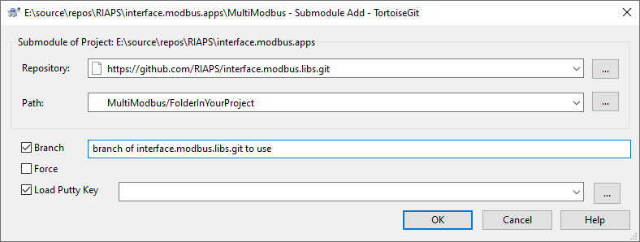

## Modbus message handling library

## This project uses the modbus-tk module for low level Modbus packet transmission.

### For information how to use this library in RAIPS see: interface.modbus.apps

##### Using TortoiseGit the submodule can be added to any project as shown below

#### Add submodule dialog

##### The git command for adding this submodule is:

    git.exe submodule add   -- "https://github.com/RIAPS/interface.modbus.libs.git" "Project/FolderToContainTheSubmodule"

    For example:

    To add this to the TestModbusOpal sub project in the interface.modbus.apps repository:

    git.exe submodule add   -- "https://github.com/RIAPS/interface.modbus.libs.git" "Python/TestModbusOpal/modbuslibs"

    This will create a new folder named 'modbuslibs' and copy the Modbus library files.

